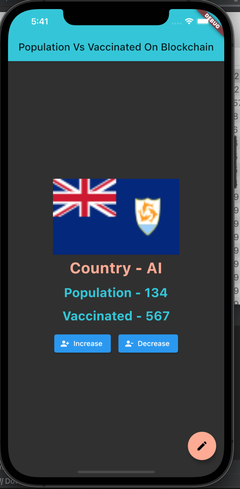

# Population On Blockchain (Flutter + Blockchain)
## Assignment

Blockchain etherium and flutter based project to manage country wise population 
and vaccinated people count.

## Getting Started

```
📁 population
    📁 lib
        🎯 contract_linking.dart
          - Update _rpcUrl, _wsUrl, _privateKey as per your needs.
```

You can test it on your local blockchain server via [Ganache](https://www.trufflesuite.com/ganache).
- Run `truffle migrate --reset`




- [Lab: Write your first Flutter app](https://flutter.dev/docs/get-started/codelab)
- [Cookbook: Useful Flutter samples](https://flutter.dev/docs/cookbook)

For help getting started with Flutter, view our
[online documentation](https://flutter.dev/docs), which offers tutorials,
samples, guidance on mobile development, and a full API reference.
